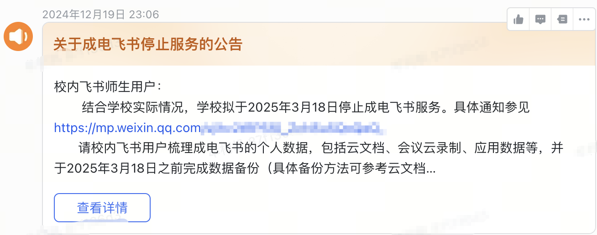

# UESTC-Network-Security-Attack-and-Defense
**UESTC电子科技大学网络安全攻防期末复习知识总结**

**建议使用Typora打开，以免出现格式错误**

**图片文件全部位于`./img`中，打开本文件请保证位于同一目录下，否则图片不能正常加载**

**飞书链接(个人账号):https://fcnj7ansjqac.feishu.cn/docx/UfiIdU1IboelG4xZtbGc2dzKnzg**

**2025-01-21**

学校停止飞书服务，故将PDF导出版放至仓库，该版受保护不可被复制和修改

若需要可修改版，请发送邮件至1622599755@qq.com获取

由于ppt文件较大故不上传，若需要，请访问蓝奏云

https://wwyq.lanzouo.com/b0nyso9ih   密码:h3e1

```	
关于成电飞书停止服务的公告

校内飞书师生用户：

​ 结合学校实际情况，学校拟于2025年3月18日停止成电飞书服务。具体通知参见https://mp.weixin.qq.com/s/#####################。

​ 请校内飞书用户梳理成电飞书的个人数据，包括云文档、会议云录制、应用数据等，并于2025年3月18日之前完成数据备份（具体备份方法可参考云文档https://uestc.feishu.cn/###############）。

​ 我们对成电飞书停服给您带来的不便深表歉意，感谢您在此期间的理解与支持。

​ 技术支持联系方式：6######4，#######@uestc.edu.cn。

​                                                                   信息中心

​                                                               2024年12月19日
```



~~**2024-09-23**~~

​	~~**太忙了,只更飞书**~~

~~**2024-09-12**~~

​	~~今天发现昨天上传的图片不是相对地址，今天已经改正~~
